# RectTransform

Ce composant permet de définir la position d'un objet **DomObject**.

## Utilisation

### Les ancres
Pour positionner un **DomObject**, il faut d'abord définir le point d'ancrage en utilisant une des méthodes de positionnement. Une fois ceci fait, on peut définir la hauteur et la largeur de l'objet **DomObject**. L'ancrage s'effectue toujours par rapport à l'objet parent. Si il n'y a pas de parents, alors c'est le body qui fait office de parent.

**Exemple 1** : Positionnement en haut et à guache :
```js
    // Création d'un DomObject
    obj = new DomObject()
    // récupération du composant RectTransform
    tr = obj.getComponenent("RectTransform")
    // Fixe le point d'ancrage en haut et à gauche
    tr.setTopLeft()
    // décallage à gauche de 15 pixels
    tr.rect.left = 15
    // décallage à partir du haut de 20 pixels
    tr.rect.top = 20
    // Definition de la largeur de l'objet
    tr.rect.setWidth(200)
    // Definition de la hauteur de l'objet
    tr.rect.setHeight(75)
    // Actualise l'objet
    obj.render()
```

Si le Stretch est défini, il est possible d'utiliser les propriétés **right** et **bottom** du rectangle. Dans ce cas, les **top**, **left**, **right** et **bottom** représentent des décallages en pixels, alors que les **verticalAnchor** et **horizontalAnchor** représentent des décallage en pourcentage de l'espace disponible du parent.

**Exemple 2** : Utilisation du stretch
```js
    // Création d'un DomObject
    obj = new DomObject()
    // récupération du composant RectTransform
    tr = obj.getComponenent("RectTransform")
    // Fixe le point d'ancrage en haut et étiré sur la largeur de la zone parente (Ici, le body)
    tr.setTopStretch()
    // décallage à gauche de 15 pixels
    tr.rect.left = 15
    // décallage à partir du haut de 20 pixels
    tr.rect.top = 20
    // décallage de 50 pixels à droite
    tr.rect.right = 50
    // l'ancre de gauche est définie à 5% de la largeur du parent
    tr.rect.horizontalAnchor.x = 0.05
    // l'ancre de droite est définie à 90% de la largeur du parent
    tr.rect.horizontalAnchor.y = 0.9
    // Definition de la hauteur de l'objet (on est pas étiré sur la hauteur)
    tr.rect.setHeight(75)
    // Actualise l'objet
    obj.render()
```


## Propriétés

| Properiétés      | Description                                             |
| ----------       | ------------------------------------------------------- |
| **anchorPreset** | Détermine le mode d'ancrage des objets **DomObject**.   |
| **rect**         | Permet de définir le rectangle de positionnement..      |
| **horizontalAnchor** | Permet de définir les points d'ancrages horizontaux en % de l'espace disponible. |
| **verticalAnchor** | Permet de définir les points d'ancrages verticaux en % de l'espace disponible. |
| **pivot** | Point de pivot utilisé pour les rotations. Le point de pivot est exprimé en % de l'objet **DomObject**. Le point 0,0 est situé en haut à gauche, le point 1,1 est situé en bas à droite de l'objet. Les valeurs peuvent être négative ou dépasser 1. Dans ce cas le pivot de rotation se situe à l'extérieur de l'objet. |
| **rotation** | Angle de rotation en degrès. |
| **scale** | Echelle de l'objet. scale.x et scale.y définissent l'échelle sur les deux axes. |

## Méthodes

### Définition de l'ancrage

Les méthodes de définition d'ancrage permette de définir le positionnement d'un **DomObject**. En utilisant ces méthodes, l'ancrage vertical et horizontal est redéfini de manière adéquate. Il convient d'utiliser les méthodes de définition d'ancrage, avant de redéfinir la postion, la largeur, et les postionnements d'ancrage.

| Pos | Méthodes         | Description                                             |
|-----| ----------       | ------------------------------------------------------- |
| 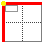| **setTopLeft()**       | positionne en haut et à gauche de l'espace parent       |
| 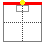| **setTop()**           | positionne en haut et au centre, tout en préservant la hauteur et la largeur de l'élément DOM.  |
| 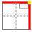| **setTopRight()**      | positionne en haut et à droite de l'espace parent       |
| 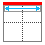| **setTopStretch()**    | positionne en haut de l'espace parent de manière étirée.|
| 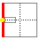| **setCenterLeft()**      | positionne au centre et à gauche de l'espace parent     |
| 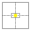| **setCenter()**         | positionne au centre, tout en préservant la hauteur et la largeur de l'élément DOM.  |
| 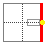| **setCenterRight()**    | positionne au centre et à droite de l'espace parent     |
| | **setCenterStretch()**  | positionne centre de l'espace parent de manière étirée. sur la largeur. |
| 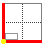| **setBottomLeft()**     | positionne en bas et à gauche de l'espace parent       |
| | **setBottom()**         | positionne en bas et au centre, tout en préservant la hauteur et la largeur de l'élément DOM.  |
| 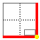| **setBottomRight()**    | positionne en bas et à droite de l'espace parent       |
| 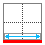| **setBottomStretch()**  | positionne en bas de l'espace parent de manière étirée.|
| 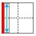| **setStretchLeft()**    | positionne à gauche de l'espace parent de manière étirée sur la verticale.|
| 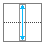| **setStretchCenter()**  | positionne au centre, de l'espace parent de manière étirée sur la verticale.|
| 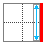| **setStretchRight()**   | positionne à droite de l'espace parent de manière étirée sur la verticale. |
| | **setStretch()**        | positionne au centre de l'espace parent de manière étirée tant en verticalité, qu'en horizontalité.|

## Constantes

### Positionnement horizontal
Ces constantes servent à définir ou a extraire le positionnement horizontal d'un objet **DomObject**.

| Constantes     | Description                                             |
| ----------     | ------------------------------------------------------- |
| APX.CENTERX    | positionne au centre sur l'axe des X                    |
| APX.LEFT       | positionne à gauche                                     |
| APX.RIGHT      | positionne à droite                                     |
| APX.STRETCHX   | positionne de manière étirée sur l'axe des X            |

**Exemple d'utilisation :**
```js
    obj = new DomObject()
    rect = obj.getComponent("RectTransform")
    if ((rect.anchorPreset & XAXIS) == APX.LEFT) {
        console.log("L'objet est ancré à gauche")
    }
```

### Positionnement vertical
Ces constantes servent à définir ou a extraire le positionnement horizontal d'un objet **DomObject**.

| Constantes     | Description                                             |
| ----------     | ------------------------------------------------------- |
| APY.CENTERY    | positionne au centre sur l'axe des Y                    |
| APY.TOP        | positionne en haut de la zone disponible                |
| APY.BOTTOM     | positionne en bas de la zone disponible                 |
| APY.STRETCHY   | positionne de manière étirée sur l'axe des Y            |

### Positionnement combiné

Les constantes de postionnement combiné permette de définir le positionnement d'un objet **DomObject** en horizontalité et en verticalité.

| Constantes     | Description                                             |
| ----------     | ------------------------------------------------------- |
| TOPLEFT        | positionne en haut et à gauche de l'espace parent       |
| TOP            | positionne en haut et au centre, tout en préservant la hauteur et la largeur de l'élément DOM.  |
| TOPRIGHT       | positionne en haut et à droite de l'espace parent       |
| TOPSTRETCH     | positionne en haut de l'espace parent de manière étirée.|
| CENTERLEFT     | positionne au centre et à gauche de l'espace parent     |
| CENTER         | positionne au centre, tout en préservant la hauteur et la largeur de l'élément DOM.  |
| CENTERRIGHT    | positionne au centre et à droite de l'espace parent     |
| CENTERSTRETCH  | positionne centre de l'espace parent de manière étirée. sur la largeur. |
| BOTTOMLEFT     | positionne en bas et à gauche de l'espace parent       |
| BOTTOM         | positionne en bas et au centre, tout en préservant la hauteur et la largeur de l'élément DOM.  |
| BOTTOMRIGHT    | positionne en bas et à droite de l'espace parent       |
| BOTTOMSTRETCH  | positionne en bas de l'espace parent de manière étirée.|
| STRETCHLEFT    | positionne à gauche de l'espace parent de manière étirée sur la verticale.|
| STRETCHCENTER  | positionne au centre, de l'espace parent de manière étirée sur la verticale.|
| STRETCHRIGHT   | positionne à droite de l'espace parent de manière étirée sur la verticale. |
| STRETCH        | positionne au centre de l'espace parent de manière étirée tant en verticalité, qu'en horizontalité.|
